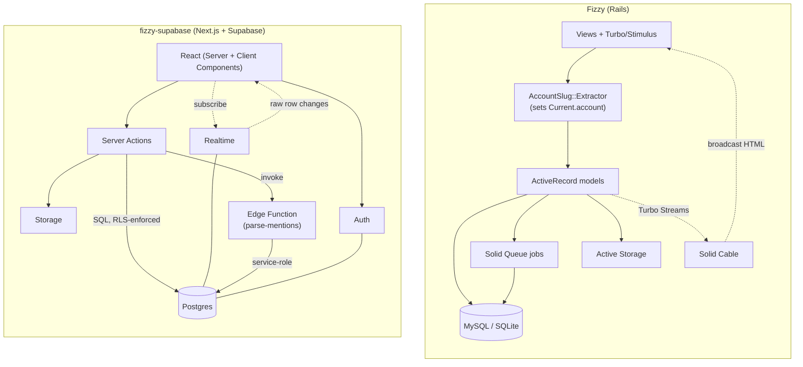
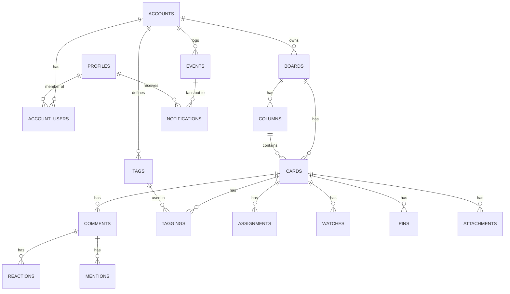
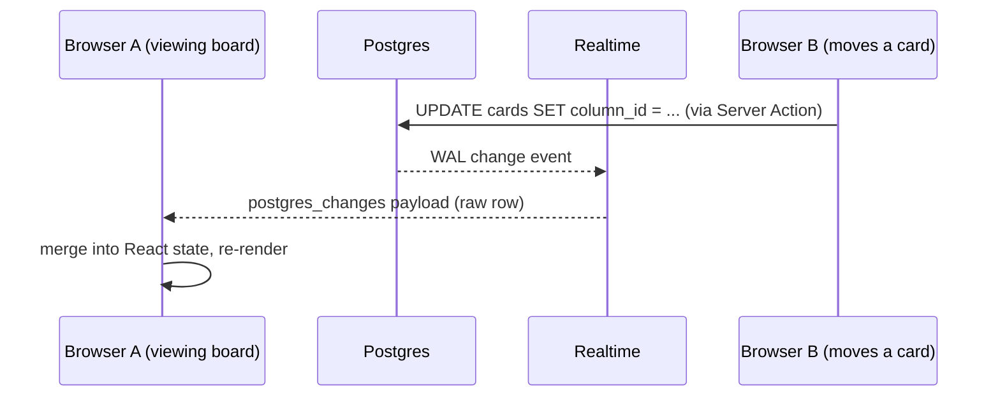
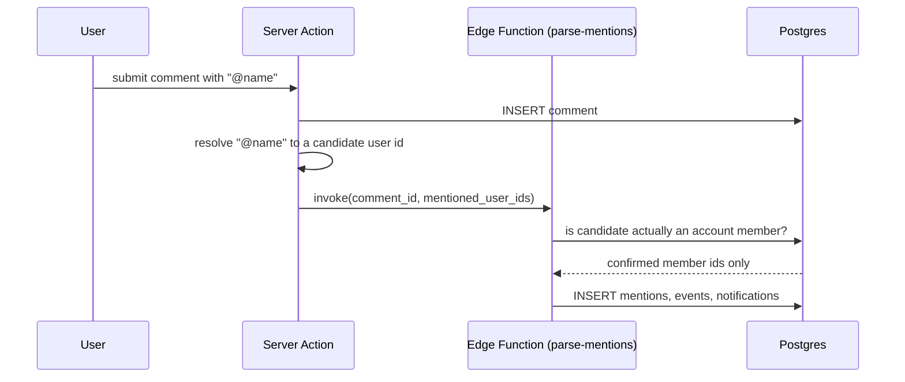

# Fizzy (Rails) vs fizzy-supabase (Next.js + Supabase): feature-by-feature

This compares how [Fizzy](https://github.com/basecamp/fizzy) — 37signals'
kanban app, built on Rails + MySQL/SQLite — implements each capability
against how this project (a personal learning exercise, not affiliated with
37signals) implements the equivalent using native Supabase features. No
Fizzy code was copied — only its publicly documented data model and feature
set were used as a reference point. Not a judgment of which is "better" —
Fizzy is a mature, production system serving real customers, and this is a
small learning project — but a look at where the two approaches genuinely
differ in shape.

## At a glance

| Capability | Fizzy (Rails) | fizzy-supabase (Next.js + Supabase) |
|---|---|---|
| Multi-tenancy | `Current.account` + URL-based middleware, enforced in Ruby | Row Level Security, enforced in Postgres |
| Auth | Hand-rolled `Identity` / `MagicLink` / `Session` models | Supabase Auth (email/password) |
| File storage | Rails Active Storage (disk in dev, S3 in prod) | Supabase Storage, tenant boundary encoded in object path |
| Live updates | Turbo Streams over Solid Cable (broadcasts rendered HTML) | Realtime `postgres_changes` (broadcasts raw row data) |
| Background/async work | Solid Queue jobs (`Notifier`, `Webhook::Delivery`) | A Deno Edge Function invoked directly from a server action |
| Search | Sharded MySQL FTS **or** SQLite FTS5, two separate code paths | One native Postgres `tsvector` + GIN index |
| Primary keys | UUIDv7, base36-encoded to 25 chars | Standard `uuid` (`gen_random_uuid()`) |
| Team invites | `Account::JoinCode` | Join codes redeemed via a `SECURITY DEFINER` function (a non-member can't read the code row under RLS) |
| Notifications | `Notifier` subclasses + Solid Queue jobs | Postgres trigger fans out rows; `send-push` Edge Function delivers VAPID web push |
| Passkeys | Hand-rolled `Passkey::Authenticator` | Supabase Auth runs the whole WebAuthn ceremony |
| Import/export | Streamed zip archives (`ZipFile`, hundreds of GB) | JSON export/import with id remapping |
| Activity spikes | `Card::ActivitySpike::Detector`, statistical vs. the card's own baseline | Plain event-count threshold over a 24h window |

## Architecture, side by side

The key structural difference: Fizzy's diagram has a Ruby layer sitting
*between* every request and the database, doing enforcement and rendering.
fizzy-supabase's diagram has the database itself doing enforcement (RLS),
with a much thinner server-action layer that mostly just calls Postgres
directly.

## Data model

Every box descending from `ACCOUNTS` carries an `account_id` column, and
every one of them has an RLS policy gated on `is_account_member(account_id)`
— this is the mechanism behind row 1 of the table above.

## 1. Database & multi-tenancy

**Fizzy:** `Account::MultiTenantable` — every request goes through
`AccountSlug::Extractor` middleware, which reads the account id out of the
URL path, sets `Current.account`, and rewrites `PATH_INFO`/`SCRIPT_NAME` so
routing behaves as if mounted under that account. Every model that needs
scoping either belongs to `Account` directly or reaches it through
associations; enforcement is entirely in the Ruby layer (controllers,
`Current`, associations) — the database has no idea what an "account" is.

**fizzy-supabase:** every tenant-owned table carries `account_id`, and a
single helper function (`is_account_member`) backs an RLS policy on each
one. There's no middleware, no `Current.account`, no per-controller
`before_action` — the enforcement lives in Postgres itself. A query that
"forgets" to scope by account still can't leak data, because the row
literally isn't visible to that role. The trade-off: you can't just `SELECT
*` and eyeball everything as an app developer/superuser without switching
roles — same isolation cuts both ways.

**Where Supabase actually wins:** the guarantee is stronger — it holds even
if a future feature branch adds a new query and the author forgets to scope
it. Fizzy's model is provably correct only if every code path remembers to
respect `Current.account`.

**Where Rails wins:** debuggability. `Board.find(id)` in a Rails console
just works; querying as `postgres`/service-role in Supabase Studio bypasses
RLS entirely, so verifying "does this policy actually restrict what I think
it restricts" requires deliberately testing as the `authenticated` role
(see the build notes — this is exactly the kind of thing that's easy to
get subtly wrong and hard to notice, since a wrong-but-permissive policy
still looks like it works from the SQL editor).

## 2. Auth

**Fizzy:** rolls its own — `Identity` (an email) can join multiple
`Account`s as a `User`; `MagicLink`/`MagicLink::Code` issues one-time login
codes; `Session` tracks the logged-in session record. All of this is
hand-written Rails code: controllers, mailers, a `Signup` model.

**fizzy-supabase:** Supabase Auth handles the entire identity/session/token
lifecycle — this project uses email+password (the `with-supabase` starter's
default), but magic links, OAuth, and passkeys are config toggles, not code.
The `account_users` join table (many accounts per user) is the one piece
that still had to be built by hand — Supabase Auth models *users*, not
*organizations*, so multi-tenancy on top of it is still the app's job, same
as Fizzy's `Identity`-to-many-`Account`s relationship really.

**Where Supabase wins:** for a green-field app, not writing password reset,
email verification, or session/token handling at all is a large amount of
undifferentiated code Fizzy carries that this project simply doesn't have.

**Where Fizzy's approach wins:** magic-link *codes* shown directly on the
page in development — zero setup, no email service needed even for auth.
Supabase's local stack gets you the same via Mailpit, but that's a second
thing to know about, not the zero-config default of "the code is right
there on the screen."

## 3. Storage

**Fizzy:** Rails Active Storage — local disk in development, S3 in
production, tracked via `Storage::Entry`/`Storage::Total` for per-account
quota accounting (a hand-rolled feature Supabase Storage doesn't have a
direct equivalent for).

**fizzy-supabase:** a single `card-attachments` Storage bucket, with the
tenant boundary encoded into the object path
(`{account_id}/{card_id}/{filename}`) and enforced via RLS policies on
`storage.objects` that parse that path with `storage.foldername()`. The
`attachments` table exists purely for metadata (filename, uploader,
content-type) — the actual bytes live in Storage.

**Friction:** `storage.objects` has no tenant column of its own, so the
"encode the boundary in the path" pattern is the recommended approach, but
it means the RLS policy and the app's upload code both have to agree on the
exact path shape independently — nothing enforces that the app always
uploads to `{account_id}/...` other than convention. A composite/generated
column derived from the object path, or a first-class "owning row" pointer
on `storage.objects`, would remove a whole class of "I forgot the path
convention" bugs.

## 4. Realtime

**Fizzy:** `Board::Broadcastable`/`Card::Broadcastable` render Turbo Stream
partials and broadcast them over Solid Cable (ActionCable backed by the
same database, not Redis) whenever a card/column changes — this is
push-based HTML fragment replacement.

**fizzy-supabase:** `boards`, `columns`, `cards`, `comments`, and
`notifications` are added to the `supabase_realtime` publication; the
client subscribes with `postgres_changes` and merges raw row payloads into
React state. This is push-based *data*, not HTML — the client owns
rendering.

**Where Supabase's model is simpler:** one `alter publication ... add
table` per table, versus writing a broadcast concern + a Turbo Stream
partial per view that needs to update live.

**Where it's more work:** Turbo Streams broadcast pre-rendered HTML, so a
Rails view update requires zero client-side state management. Postgres
Changes broadcasts raw rows, so the client has to reconcile them into
existing state itself (see `components/board-view.tsx`'s manual
insert/update/delete merge logic) — there's no server-authored view to
just swap in.

## 5. Edge Functions

**Fizzy:** background work — sending notifications, delivering webhooks —
runs through Solid Queue (`Notifier::CardEventNotifier`,
`Webhook::Triggerable`, `Webhook::Delivery`), a database-backed job queue
that ships with Rails 8 and stays in the same process/deploy as the app.

**fizzy-supabase:** `supabase/functions/parse-mentions` is a separate Deno
runtime, deployed independently of the Next.js app, invoked directly from a
server action after a comment is created.

It re-validates the client's mention list against real account membership
(never trusting the client), then writes `mentions` + `notifications` rows
using the service-role key — the one place in this project that
deliberately steps outside RLS, because the function itself *is* the
trusted boundary.

**Friction:** there's no built-in retry/backoff or delivery-tracking for a
direct `functions.invoke()` call the way Solid Queue gives you for free —
if the invocation fails, that comment's mentions are just silently
unprocessed. Fizzy's `Webhook::Delivery` + `Webhook::DelinquencyTracker`
exist precisely because "fire an HTTP call and hope" isn't good enough for
production; an Edge-Function-triggered-by-Database-Webhook pattern (insert
a row, Postgres calls the function asynchronously with its own retry) would
have been the more apples-to-apples comparison to a job queue, at the cost
of one more moving part (`pg_net` + a webhook secret) to configure.

## 6. Later additions

The first pass covered the five headline Supabase features. Filling in the
rest of Fizzy's surface area surfaced a few more comparisons worth noting.

### Webhooks: job queue vs. `pg_net` trigger

**Fizzy:** `Webhook::Triggerable` enqueues a Solid Queue job per delivery;
`Webhook::Delivery` records the outcome and `Webhook::DelinquencyTracker`
backs off endpoints that keep failing.

**fizzy-supabase:** a trigger on `events` calls `net.http_post` for each
active endpoint and writes a `webhook_deliveries` row. pg_net queues the
request and returns immediately, so a dead endpoint never blocks the write
that triggered it — but there's no retry/backoff, which is exactly what
Fizzy's delinquency tracking exists to provide. Fire-and-forget from the
database is less code; a job queue is what you actually want once endpoints
start misbehaving.

### Push: encrypted payloads vs. a bodyless nudge

**Fizzy:** the `web-push` gem encrypts the notification body per RFC 8291 and
delivers it, so the notification text arrives with the push.

**fizzy-supabase:** `send-push` signs a VAPID JWT with Web Crypto and sends
a *bodyless* push; the service worker shows a generic "new activity" message
and links into the inbox, which loads the real content over an authenticated
request. That skips implementing aes128gcm entirely, and has the side effect
that no notification content passes through a third-party push service —
at the cost of an extra round trip before the user sees what happened.

### Triage and card states

Fizzy's `Card::NotNow`, `Card::Golden`, `Card::Closeable` and
`Board::Triageable` are Ruby concerns mixed into the model, each with their
own tables where they need extra data (`card_not_nows`, `card_goldnesses`).
Here they're plain nullable columns on `cards` — the state *and* when it
happened, filterable directly in SQL without a join:

| State | Columns |
|---|---|
| Closed | `closed_at`, `closed_by` |
| Golden | `golden_at`, `golden_by` |
| Not now | `not_now_until` |
| Triaged | `triaged_at` |

Two composite indexes (`cards_not_now_idx`, `cards_triage_idx`, each on
`board_id` plus the relevant timestamp) keep the board and triage queries off
a sequential scan. They're not partial, though they arguably should be —
both columns are null for most rows, and `where not_now_until is not null`
would index a small fraction of the table instead of all of it.

Simpler, but the cost is real and worth stating precisely: that's six columns
across four states, because anything tracking *who* acted needs a second
column alongside the timestamp. Fizzy pays for attribution with a join;
this pays for it by widening every card row, including the ones that will
never be golden or closed. At Fizzy's cardinality neither choice matters —
but the side-table approach is the one that stays flat as workflow states
accumulate, and this one isn't.
