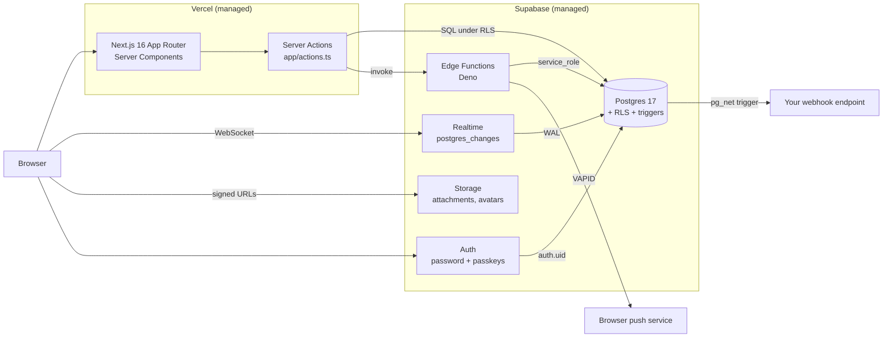
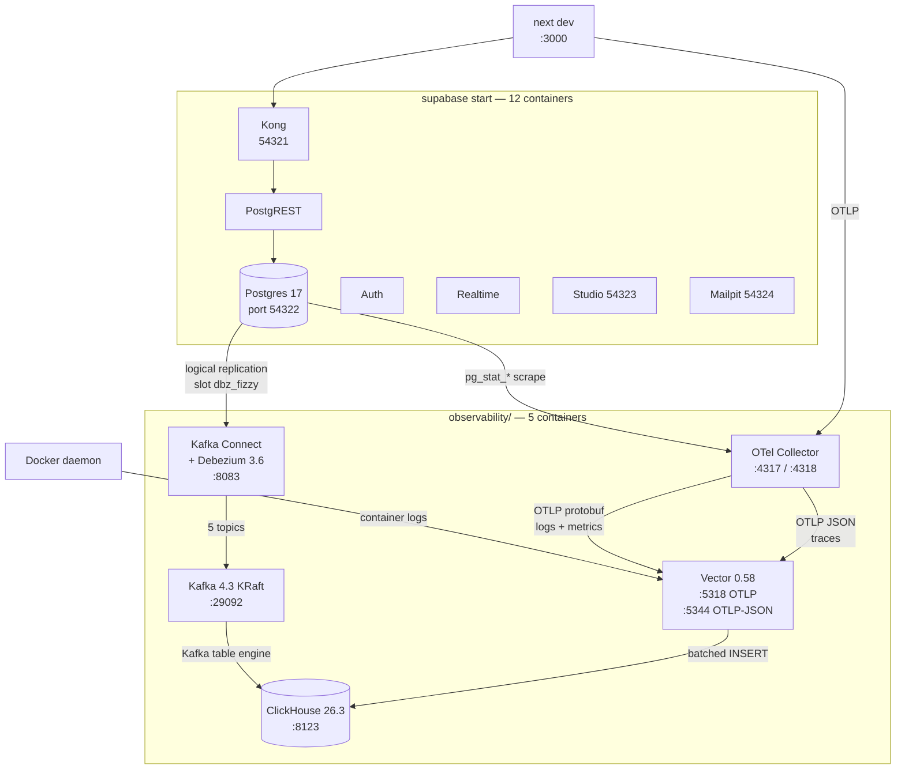
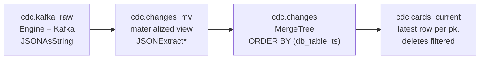

# Infrastructure architecture

Two environments, deliberately different in kind rather than in size.

**Production** is fully managed: Vercel in front, Supabase behind, nothing to
operate. **Local** adds a second, self-hosted stack next to it — Kafka,
Debezium, ClickHouse, an OpenTelemetry Collector and Vector — so the data
paths that Supabase sells as managed products (Pipelines, Log Drains, the
Metrics API) can be built by hand and understood. Nothing in the local stack
is required to run the app.

Everything below is running and verified, not aspirational; see
[Verifying](#verifying).

---

## 1. Production



No servers, no containers, no queue, no worker. The only always-on background
machinery is inside Postgres itself: triggers plus `pg_net` for outbound HTTP.

| Concern | How it is handled | Where |
|---|---|---|
| Tenant isolation | Row Level Security, no application-level checks | `supabase/migrations/*` |
| Background work | Postgres triggers + `pg_net`; `after()` for post-response work | `app/actions.ts` |
| Fan-out to users | Realtime `postgres_changes` on the client | `components/board-view.tsx` |
| Async server logic | Edge Functions invoked from Server Actions | `supabase/functions/*` |

### Trust boundaries

There are only two, and both are Postgres-enforced:

1. **Browser → Postgres.** The publishable key is public by design. Every
   query runs as `authenticated` or `anon` and is filtered by RLS.
2. **Edge Function → Postgres.** Functions hold `service_role`, which
   **bypasses RLS entirely**. Any tenant filtering there is hand-written and
   must be reviewed as security-critical code.

---

## 2. Local

`supabase start` brings up twelve containers; `observability/` adds five more
on the same Docker network. The second group is optional and additive — stop
it and the app is unaffected.



### The four data paths

| Path | Source | Transport | Lands in | Latency observed |
|---|---|---|---|---|
| CDC | Postgres WAL | Debezium → Kafka | `cdc.changes` | ~5 s |
| Metrics | `pg_stat_*` | Collector → Vector | `otel.metrics` | ~15 s (scrape interval) |
| Logs | Docker daemon | Vector directly | `otel.logs` | ~2 s |
| Traces | App OTLP | Collector → Vector | `otel.traces` | ~3 s |

### Why Vector *and* a Collector

They are not redundant, and the split is the point:

- The **Collector** speaks the telemetry ecosystem: it scrapes Postgres, terminates
  OTLP from the app, and normalises everything into one wire format. It is where
  you would add sampling, redaction, or a second backend.
- **Vector** is the single writer to ClickHouse. It batches, retypes, and shapes
  rows to match the table schemas. Having exactly one process that owns the
  `INSERT`s means one place to reason about backpressure and one place a schema
  change can break.

This mirrors the hosted arrangement: Supabase's Log Drain is the collector, and
whatever you run behind it is the writer.

### Local ↔ hosted equivalents

The local stack is not a toy version of production — it is a hand-built
version of things Supabase would otherwise sell you.

| Capability | Hosted Supabase | Local equivalent here |
|---|---|---|
| CDC to a warehouse | Pipelines → ClickHouse destination (Early Access, org-gated) | Debezium → Kafka → ClickHouse Kafka engine |
| Platform logs | Log Drains (Pro+, ~$60/mo per drain + $0.20/M events) | Vector `docker_logs` source |
| Database metrics | Prometheus endpoint at `/customer/v1/privileged/metrics` (not available self-hosted) | Collector `postgresql` receiver |
| Traces | None emitted server-side; only `trace_id` correlation in gateway logs | Collector OTLP receiver, app-instrumented |

The traces row is the one real gap. Supabase does not produce server-side spans
in either environment — what it offers is W3C trace-context propagation, so a
`trace_id` you generate flows through API Gateway and Edge Function logs and can
be joined to your own spans. Locally that join is a single query, because both
sides land in the same ClickHouse:

```sql
SELECT t.name, t.duration_ns, l.message
FROM otel.traces AS t
LEFT JOIN otel.logs AS l USING (trace_id)
WHERE t.service = 'fizzy-web';
```

---

## 3. CDC data model

Debezium emits one topic per table, named `fizzy.public.<table>`, each message
a full envelope:

```json
{
  "before": { "id": "…", "name": "old" },
  "after":  { "id": "…", "name": "new" },
  "source": { "table": "boards", "lsn": 24035112, "…": "…" },
  "op": "u",
  "ts_ms": 1789000000000
}
```

`op` is `c`reate, `u`pdate, `d`elete, or `r`ead (initial snapshot).

ClickHouse consumes this itself — no sink connector — with a `Kafka` table
engine reading `JSONAsString` into a single opaque column, and a materialized
view shredding it into typed columns. Reading the message as one string means a
Postgres schema change cannot break ingestion; it only changes what sits inside
`after`, and re-shredding is a view change rather than a pipeline outage.



`cdc.changes` is the append-only log; `cdc.cards_current` collapses it to
current state with `LIMIT 1 BY pk`. Those are exactly the two shapes Supabase
Pipelines offers as `MergeTree` and `ReplacingMergeTree` — written out longhand
so the mechanics are visible rather than configured away.

### `REPLICA IDENTITY FULL`

Debezium can only populate `before` if Postgres logs the full pre-image, so
`observability/debezium/prepare-postgres.sql` sets `replica identity full` on
the five replicated tables. This roughly doubles WAL volume for updates and
deletes, which is exactly why it is **not** a Supabase migration — running it
against the hosted project would make production pay for a local demo.

### ⚠️ CDC bypasses RLS

This deserves to be stated plainly, because it inverts the security model the
rest of this app relies on.

Every tenant boundary in this project is a Row Level Security policy. Logical
replication reads the **write-ahead log**, which is below RLS: the Kafka topics
contain every account's rows, flattened, unfiltered. Anything downstream of
Debezium is a new trust boundary with none of the app's protections.

If this were ever more than a local experiment, the mitigations are: filter at
the publication (`for table cards where (account_id = '…')`), partition topics
by tenant, and treat the consumer as security-critical. Locally it is fine
because the whole stack is one developer's laptop and the database contains
test data.

---

## 4. Resource budget

Docker Desktop is allocated 8 GB on this machine. Measured steady state:

| Group | Memory |
|---|---|
| Supabase (12 containers) | ~1.9 GB |
| ClickHouse | ~1.0 GB (capped at 1.5 GB via `config.d/low-mem.xml`) |
| Kafka Connect + Debezium | ~830 MB |
| Kafka | ~620 MB |
| Vector | ~54 MB |
| OTel Collector | ~106 MB |
| **Total** | **~4.5 GB** |

The JVM pair costs more than everything else combined, which is the honest
argument for the managed version: Pipelines replaces 1.4 GB of Kafka and
Connect with a checkbox.

Two deliberate constraints:

- **ClickHouse sizes caches from total host RAM by default**, which is wrong
  inside a memory-limited Docker VM. `max_server_memory_usage` is pinned.
- **Kafka storage is not on a volume.** A restart loses the broker's data. For
  a demo that is a feature — the bootstrap script is idempotent and rebuilds
  everything — but it would obviously be wrong in production.

---

## 5. Verifying

```sh
cd observability
docker compose up -d
./scripts/bootstrap.sh   # publication, replica identity, connector
./scripts/verify.sh      # 11 checks, all four paths
```

`verify.sh` writes a real row to Postgres and posts a real span to the
collector, then **polls** ClickHouse for both. Polling rather than sleeping is
deliberate: every path here is asynchronous, and fixed sleeps produce tests
that either flake or waste time.

Current state:

```
cdc.changes      60
otel.logs       189
otel.metrics  80044
otel.traces       3
```

---

## 6. What this deliberately is not

- **Not production-grade.** Single Kafka broker, no replication, no auth
  between components, plaintext credentials in the compose file. Everything
  binds to localhost on one machine.
- **Not required.** The app has no dependency on any of it. `docker compose
  down` in `observability/` leaves the Supabase stack and the app untouched.
- **Not a Supabase deployment pattern.** Supabase does not run this for you;
  see the comparison table above for what it does run.

Issues hit while building it are in [`FRICTION_LOG.md`](../FRICTION_LOG.md),
entries 9–13.
